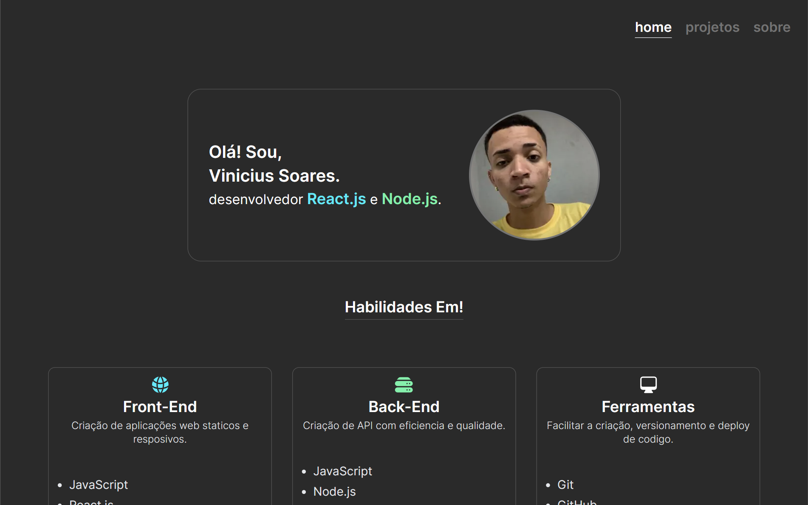

# Portfolio

  Projeto feito em React onde faço a demostração de todos os meus projetos salvos GitHub atraves de sua API publica.

  Com as seguintes rotas, Home, Projetos e Sobre.

## 🔗 Tecnologias Utilizadas

- React.js
  - Composition
  - Custon Hooks
- TailwindCSS
- Estrutuara de Roteamento do Next.js 14
- API de dados do GitHub
